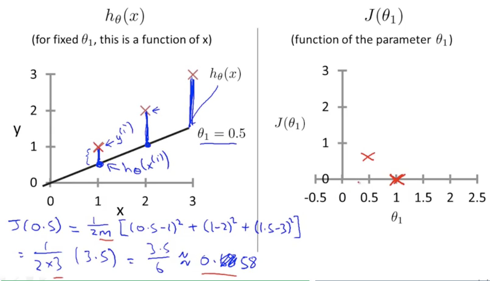

# Week1

## Introduction

### 1. Welcome

#### Machine Learning Examples?

> - rank pages.
> - Recognize photos.
> - Spam

### 2. What is machine learning?

#### Definition

A computer program is said to learn from experience **E** with respect to some task **T** and some performance measure **P**, if its performance on **T**, as measured by **P**, improves with experience **E**.

#### Types of Learning Algorithm

##### Two most used algorithms:

> - Supervised Learning
> - Unsupervised Learning

 Others: Reinforcement learning, recommender systems

##### * Also talk about: Practical advice for applying learning algorithms.

### 3. Supervised Learning

#### Supervised Learning: "right answers" given

###### Supervised learning problems are categorized into 2 problems

> - Regression: Predict continuous valued output e.g. Housing price prediction
> - Classification: Discrete valued output (0 or 1) e.g. Breast cancer

###### Breast cancer:

can have multiple features: Tumor Size, Age, Clump Thickness, Uniformity of Cell Size, Uniformity of Cell Shape, ...

#### Q: How about infinite number of features?

Support Vector Machine uses math trick to solve the problem

### 4. Unsupervised Learning

#### Unsupervised Learning: approach problems with little or no idea what our results should look like. 

We can derive this structure from data where we don't necessarily know the effect of the variables.

We can derive this structure by clustering the data based on relationships among the variables in the data.

With unsupervised learning, there is no feedback based on the prediction results.

#### Examples:

> - Clustering: Take a collection of different genes, and find a way to group them into groups that are somehow similar or related by different variables, such as lifespan, location, roles, and so on.
> - Non-clustering: Cocktail Party Algorithm, find structure in a chaotic environment. (i.e. identify individual voices and music from a mesh of sounds at a cocktail party.)

## Review

5/5

## Model and Cost Function

### 1. Model Representation

Given training set, we have m number of input data. with x as input, y as output.

$x^{(i)}$ means the i-th input

$y^{(i)}$ means the i-th output

Our goal is to learn a function $$h: X \rarr  Y $$ so that h(x) is a "good" predictor for the corresponding value of y. For historical reasons, this function is called **hypothesis**. 

### 2. Cost Function

$$ h_{\theta}(x) = \theta_{0} + \theta_{1}x$$,  we have $\bf{\theta}$ as parameters.

Our idea is to choose $\theta_{0}$ and $\theta_{1}$ so that $h_{\theta}(x)$ is close to y for our training example (x, y).

In order to measure the accuracy of the hypothesis funciton, here we have $$J(\theta_{0}, \theta_{1})$$ as the **cost function**, also known as **squared error function** or **mean squared error**.

> - Note that: the mean is halved $(\frac{1}{2})$ as a convenience or the computation of the gradient descent, as the derivative term of the square function will cancel out the $\frac{1}{2}$ term.

#### Intuition

$h_{\theta}(x)$ **is function of x while cost function $J(\theta_{0}, \theta_{1})$ is function of $\theta$. To visualize, we have the following figure with $\theta_{1} = 1$.**

 

**We also have figure with $\theta_{1} = 0.5$ as follows.**

**To plot all of them, we have** 

**Our goal is to get the minimum J($\theta_{1}$). **

**Next, we will talk about algorithms to get to the minimum automatically.**

## Parameter Learning